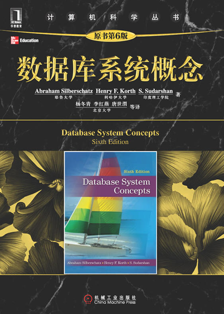

# database system principle 2020
## thinking at the beginning of the class
毛泽东 七律·送瘟神·其一 1958.6

绿水青山枉自多，华佗无奈小虫何！

千村薜荔人遗矢，万户萧疏鬼唱歌。

坐地日行八万里，巡天遥看一千河。

牛郎欲问瘟神事，一样悲欢逐逝波。
## textbook
Avi Silberschatz, Henry F. Korth, S. Sudarshan. **Database System Concepts 6th Edition**. McGraw-Hill, ISBN 0-07-352332-1

## coursewares
### Introduction

Introduction

## database labs
### Lab1: prepare for database labs
#### Operating System
Mysql Community Server supports all kinds of Operating Systems, such as Windows10 , MacOS or Linux

#### Install and Config MySQL Database
[MySQL 8.0.19](https://dev.mysql.com/downloads/mysql/)
[Windows (x86, 32-bit), MSI Installer](https://dev.mysql.com/downloads/windows/installer/8.0.html)

mysql-installer-community-8.0.19.0.msi
MD5: 1a882015da7fb93f20c4717e63b6817c

#### The First Step:
Create a new database or schema
#### The Second Step:
Create a new db user for the above database
#### The Third Step:
Importing DDL_createtbwithpredrop_al.sql into mysql db  
open mysql client app: 
source DDL_createtbwithpredrop_al.sql 
#### The Fourth Step:
do labs step by step 

