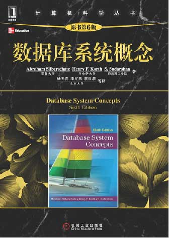

# database system principle
## thinking at the beginning of the class
毛泽东 七律·送瘟神·其一 1958.6 
绿水青山枉自多，华佗无奈小虫何！千村薜荔人遗矢，万户萧疏鬼唱歌。 
坐地日行八万里，巡天遥看一千河。牛郎欲问瘟神事，一样悲欢逐逝波。 

## coursewares

### Lecture 9
[Relational Algebra and Calculus](./docs/lecture006DbSystemRelationalAlgebraCalculus.pdf)

### Lecture 8
[SQL Query Language Advanced](./docs/lecture005DbSystemSQL3advanced.pdf)

### Lecture 6~7
[SQL Query Language Intermediate](./docs/lecture004DbSystemSQL2intermediate.pdf)

### Lecture 5
[SQL Query Language](./docs/lecture003DbSystemSQL1basicR6.pdf)

### Lecture 3~4
[Relational DB Model](./docs/lecture002DbSystemRDbModelR6.pdf)

### Lecture 1~2
[Introduction](./docs/lecture01DbSystemIntroR6.pdf)

## database labs

see [labs/README.md](./labs/README.md) 
### Lab7: Stored Function in SQL
[lab07 Stored Function in SQL](./labs/lab07DbSystemAdSQLFuncStudent.pdf) 

### Lab6: SQL performance Test
[lab06 SQL performance Test](./labs/lab06DbSystemSQLperformanceTestStudent.pdf) 
[db script](./res/sqlperformancetest.sql)

### Lab5: python and advanced sql II
[lab05 python and advanced sql II ](./labs/lab05DbSystemBasicSQL3_view_rankStudent.pdf)

### Lab4: python and advanced sql
[lab04 python and advanced sql ](./labs/lab04DbSystemBasicSQLStudent.pdf)

### Lab3: python and basic sql
[lab03 python and basic sql ](./labs/lab03DbSystemStudent.pdf)

### Lab2: create new db and import data
[lab02 create new db and import data](./labs/lab02DbSystemStudent.pdf)

### Lab1: prepare for database labs
[lab01 Prepare the basic environment](./labs/lab01DbSystemPrepareStudent.pdf)

## textbook
Avi Silberschatz, Henry F. Korth, S. Sudarshan. **Database System Concepts 6th Edition**. McGraw-Hill, ISBN 0-07-352332-1

## poem for digital age
赞数字文明 2017 
文明初叶几时真，造化阴阳始幻尘。 
书简成山薪火旺，零壹遁迹智能春。 
有形百载多将朽，数字千年总是新。 
懵懂蹒跚别旧日，一朝奋起笑前津。 
